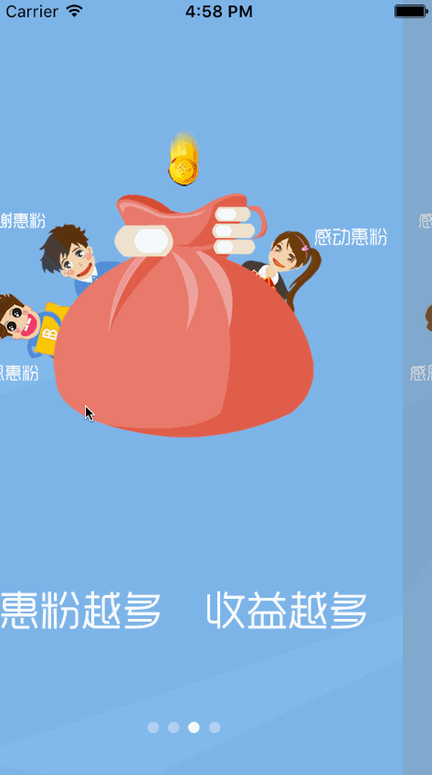

# SYGuideView
APP首次使用时的引导页设置

# 效果图
 

* 使用介绍
  * 自动导入：使用命令`pod 'SYGuideView'`导入到项目中
  * 手动导入：或下载源码后，将源码添加到项目中

# 使用示例
~~~ javascript
// 引入头文件
#import "SYGuideView.h"

设置协议 SYGuideViewDelegate
~~~ 

~~~ javascript
// 判断是否首次使用
BOOL isFirstUsing = GuideViewAppStatus();

if (!isFirstUsing) {
    // 非首次使用 保存首次使用的状态
    GuideViewSaveAppStatus();
}
~~~ 

~~~ javascript
// 实例化引导页 视频
SYGuideView *guideView = [[SYGuideView alloc] init];
[UIApplication.sharedApplication.delegate.window addSubview:guideView];
// 播放视频时
guideView.filePath = [NSBundle.mainBundle pathForResource:@"denza" ofType:@"mp4"];
guideView.guideType = UIGuideViewTypeVideo;

guideView.delegate = self;
[guideView reloadData];
~~~

~~~ javascript
// 实例化引导页 图片
SYGuideView *guideView = [[SYGuideView alloc] init];
[UIApplication.sharedApplication.delegate.window addSubview:guideView];
guideView.delegate = self;
[guideView reloadData];
~~~

~~~ javascript
// 实例化引导页 带倒计时
SYGuideView *guideView = [[SYGuideView alloc] initWithFrame:UIApplication.sharedApplication.delegate.window.bounds];
[UIApplication.sharedApplication.delegate.window addSubview:guideView];
// 倒计时
[guideView timerStart:6.0 complete:^(SYGuideView *view, NSTimeInterval time) {
    NSString *title = [NSString stringWithFormat:@"%.0fs", time];
    NSLog(@"%@", title);
    if (time <= 0.0) {
        [view removeFromSuperview];
    }
}];

guideView.delegate = self;
[guideView reloadData];
~~~ 

~~~ javascript
// 代理方法
// 视图数量
- (NSInteger)guideViewPages:(SYGuideView *)guideView
{
    if (guideView.tag - tagGuideView == 0) {
        return self.arraySingle.count;
    } else if (guideView.tag - tagGuideView == 1) {
        return self.arrayMore.count;
    }
    return 1;
}

// 自定义显示视图
- (UIView *)guideView:(SYGuideView *)guideView page:(NSInteger)index
{
    if (guideView.tag - tagGuideView == 0) {
        UIImageView *view = self.arraySingle[index];
        return view;
    } else if (guideView.tag - tagGuideView == 1) {
        UIImageView *view = self.arrayMore[index];
        return view;
    }
    return nil;
}

// 视图点击效果
- (void)guideView:(SYGuideView *)guideView didClickPage:(NSInteger)index
{
    NSLog(@"index = %ld", index);
    if (guideView.tag - tagGuideView == 0) {
        // 放大淡化再消失
        [UIView animateWithDuration:0.6 animations:^{
            guideView.transform = CGAffineTransformMakeScale(1.6, 1.6);
            guideView.alpha = 0.0;
        } completion:^(BOOL finished) {
            [guideView removeFromSuperview];
        }];
    } else if (guideView.tag - tagGuideView == 1) {
        // 向下淡化再消失
        [UIView animateWithDuration:0.6 animations:^{
            guideView.frame = CGRectMake(guideView.frame.origin.x, guideView.frame.size.height, guideView.frame.size.width, guideView.frame.size.height);
            guideView.alpha = 0.0;
        } completion:^(BOOL finished) {
            [guideView removeFromSuperview];
        }];
    }
}

// 视图是否可点击
- (BOOL)guideView:(SYGuideView *)guideView shouldClickPage:(NSInteger)index
{
    if (guideView.tag - tagGuideView == 0) {
        if (index == self.arraySingle.count - 1) {
            return YES;
        }
    } else if (guideView.tag - tagGuideView == 1) {
        if (index == self.arrayMore.count - 1) {
            return YES;
        }
    }
    return NO;
}

// 完成回调（用于视频播放）
- (void)guideViewComplete:(SYGuideView *)guideView
{
    if (guideView.tag - tagGuideView == 2) {
        UIImageView *imageView = [[UIImageView alloc] initWithImage:[UIImage imageNamed:@"denza"]];
        [guideView.superview addSubview:imageView];
        imageView.frame = guideView.superview.bounds;
        guideView.alpha = 0.0;
        sleep(2);
        [UIView animateWithDuration:0.6 animations:^{
            imageView.alpha = 0.0;
        } completion:^(BOOL finished) {
            [imageView removeFromSuperview];
            [guideView removeFromSuperview];
        }];
    }
}

~~~

# 使用示例
 

## 修改完善
* 20190926
  * 版本号：
  * 修改完善
    * 支持图片和视频
    * 使用代理设计模式
    * 自定义视图

* 20170711
  * 修改名称：SYGuideScrollView改成SYGuideView
  * 枚举值抽离：SYGuideHeader
  * 添加引导页类型SYGuideViewType：图片轮播、动图、视频——待完善
  * 添加引导页操作类型：手动消失、计时器消失——待完善

~~~javascript
/// 引导页视图类型（默认图片轮播、动图、视频）
typedef NS_ENUM (NSInteger, SYGuideViewType)
{
/// 引导页视图类型-图片轮播，默认
SYGuideViewTypeDefault = 0,

/// 引导页视图类型-动图
SYGuideViewTypeGif = 0,

/// 引导页视图类型-视频
SYGuideViewTypeVideo = 0,
};
~~~
~~~ javascript
/// 计时器消失
@property (nonatomic, assign) BOOL isAutoHidden;
/// 计时器时间（默认3秒）
@property (nonatomic, assign) NSTimeInterval autoTime;
~~~

